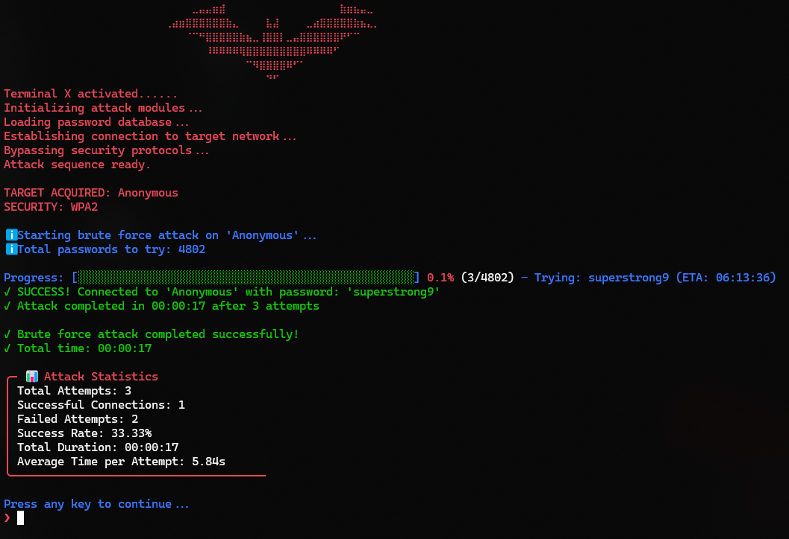

<div align="center">
    
<!--   this is the old banner -->


<!-- https://github.com/user-attachments/assets/c9eeaf74-6649-4810-b420-e2c4ad4bd365 -->


<br>
</div>

> [!Tip]
> This project is part of the [FadSec Lab suite](https://github.com/fadsec-lab). <br> Discover our focus on ad-free, privacy-first applications and stay updated on future releases


---


<div align="center">

# `>_` Wifade

**Command-Line WiFi Manager with Integrated Brute-Forcer.**

_Linux and macOS support coming soon!_


[](https://github.com/anonfaded/wifade/releases/)

</div>

---

## `>_` 🚀 Features

Wifade is a modern, terminal-based WiFi manager with an integrated brute-forcer for Windows (Linux/macOS support coming soon). It offers:

*   **👨‍💻 Interactive TUI (Text-based UI):** A polished, menu-driven interface for easy navigation and operation.
*   **📶 Wi-Fi Management:**
    *   **Scan:** Discover and list all available Wi-Fi networks with details like signal strength, encryption type, and status.
    *   **Connect:** Connect to any Wi-Fi network, including open and password-protected ones.
    *   **Status:** Get a detailed report of your current connection, including private/public IP, gateway, DNS, MAC address, and link speed.
    *   **Control:** Disconnect from networks or restart your Wi-Fi adapter with simple commands.
*   **🔑 Integrated Brute-Forcer:**
    *   **Dictionary Attack:** Test network password strength using a built-in wordlist of over 4,700 common passwords.
    *   **Custom Wordlists:** Select and use your own custom password files for targeted testing.
*   **⚡️ Quick CLI Actions:** Bypass the interactive UI for instant results. Use flags to get your IP, scan networks, check status, and more.

*Linux and macOS support is planned and in development. Stay tuned for cross-platform releases!*

## `>_` 📦 Installation (Windows)

1. Go to the [**GitHub Releases**](https://github.com/anonfaded/wifade/releases) page.
2. Download the latest `WifadeSetup-X.X.exe` installer.
3. Run the installer. It requires administrator privileges to add `wifade` to your system's PATH.
4. Once installed, you can open any terminal and run the `wifade` command, or launch Wifade via the Start Menu or desktop shortcut.

*Linux and macOS installation instructions will be provided when those versions are released.*

## `>_` 🖥️ Usage (Windows)

Wifade can be launched in two modes: Interactive Mode for a full user interface, or CLI Mode for quick, direct commands.

### `>_` Interactive Mode

Simply run the command without any parameters to launch the full interactive interface.

```sh
wifade
```

### `>_` CLI Mode (Quick Actions)

Use flags to perform actions instantly without entering the interactive menu. This is perfect for scripting or quick checks.

```powershell
# Display comprehensive Wi-Fi status
wifade -status
# Sample output:
╭─ 📶 Wi-Fi Connection Status
│ SSID       : HomeWifi
│ Signal     : ████ 96%
│ Encryption : WPA2
│ Private IP : 192.168.1.8
│ Public IP  : xx.xx.xx.1
│ Gateway    : 192.168.1.1
╰────────────────────────────────────

# Scan for and list available networks
wifade -scan
# Sample output:
╭─ 📶 Available Networks
│
│ #  SSID                     Signal     Encryption      Status
│ ──────────────────────────────────────────────────────────────────
│ 1  Home                      ████ 98%  WPA2           Available
│ 2  Wifi_asdwead              ████ 100% Open           Available
│ 3  HomeFloor2                ████ 90%  WPA2           Available

# Get your private IP address
wifade -ip
# Sample output:
192.168.1.42

# Get your public IP address
wifade -publicip
# Sample output:
2xx.0.113.7

# Connect to a network directly
wifade "MyNetwork" mypassword123
# Sample output:
Connecting to 'MyNetwork'...
Connection successful!

# See a quick reference of all commands
wifade -list
# Sample output:
╭─ 📋 Wifade - Quick Parameter Reference
│
│ ⚡ QUICK ACTIONS:
│   -IP                         Show current private IP address
│   -Status                     Show Wi-Fi connection status
│   -Scan                       List available Wi-Fi networks
│   -PublicIP                   Show current public IP address

# Show detailed help documentation
wifade -help
# Sample output:
╭─ 📖 Wifade Help Documentation
│
│ 🚀 USAGE:
│    wifade [OPTIONS]
│
│ ⚙️ OPTIONS:
│    -Help, -h                   Display this help information
│    -Version                    Display application version and exit
│    -List                       List all available command-line parameters
```

_Linux and macOS usage instructions coming soon._

## `>_` 💀 Attack Mode

Wifade's password security testing features are accessible from the interactive menu.

1. **Dictionary Attack:** Uses the built-in `probable-v2-wpa-top4800.txt` wordlist. This file contains over 4,700 of the most common WPA passwords.
2. **Custom Password File:** Allows you to use your own wordlist. You can select a `.txt` file using the file picker dialog.

Upon entering Attack Mode for the first time, you will be required to accept an **ethical usage disclaimer**.


## `>_` 📸 Screenshots

<p align="center">
  
</p>
*Interactive menu-driven interface showing available options.*

<p align="center">
  
</p>
*Help page*

<p align="center">
  
</p>
*Network Scanning mode*

<p align="center">
  
</p>
*Status output displaying connection details and IP information.**

<p align="center">
  
</p>
*Attack Mode displaying password cracking attempts and progress status.*

<details>
    <summary>🛠️ Building from Source (Windows)</summary>

If you want to build the project yourself, follow these steps:

1. Ensure you have **PowerShell 7+** installed.
2. Install the required `ps2exe` module:

    ```powershell
    Install-Module -Name ps2exe -Force
    ```

3. Run the build script from a PowerShell 7 terminal with **Administrator privileges**:

    ```powershell
    ./Build-Wifade.ps1
    ```

4. The compiled executables (`wifade.exe`, `WifadeCore.exe`) and other assets will be placed in the `build/` directory.


</details>
<!-- markdownlint-enable MD033 -->

_Linux/macOS build instructions will be added when those versions are released._

## `>_` ⚖️ Disclaimer

This tool is intended for **educational purposes and ethical security testing only**.

* Do not test networks you do not own or have explicit, written permission to test.
* Unauthorized access to computer networks is illegal. You are solely responsible for your actions.
* The developer of Wifade is not responsible for any misuse of this tool.

## `>_` 🤝 Contributing

Contributions are welcome! If you'd like to help improve **Wifade** or test upcoming Linux/macOS support, fork the repository, make your changes, and submit a pull request. Please open an issue for bugs or feature requests.
